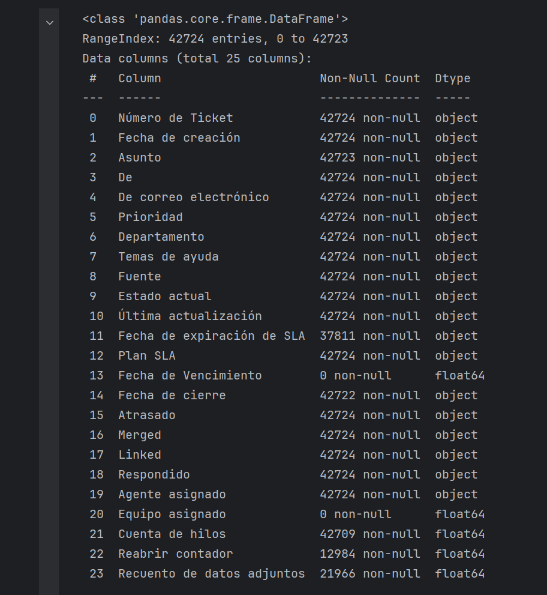
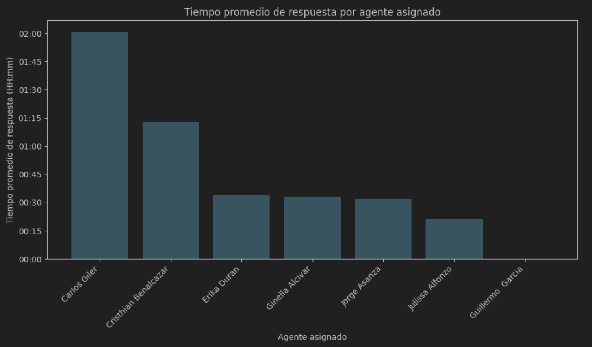

# ETL_Varios
El repositorio contiene scripts de ETL en Python para procesar datos, utilizando bibliotecas como pandas para la limpieza y matplotlib para la visualización, facilitando el análisis y la transformación de datos de manera eficiente y efectiva.

### Descripción Detallada del Primer Script de ETL para Análisis de Tickets de Soporte

El primer script del repositorio está diseñado para procesar datos de tickets de soporte utilizando Python, haciendo uso extensivo de bibliotecas como pandas para manipulación y limpieza de datos, y matplotlib para la visualización de resultados. A continuación se detallan las funcionalidades y procesos implementados:

#### Proceso ETL:

1. **Extracción de Datos:**
   - El script comienza extrayendo datos de un archivo CSV que contiene información sobre todos los tickets de soporte desde la creación del servicio.

2. **Transformación de Datos:**
   - Filtrado de datos: Se seleccionan únicamente los tickets que fueron cerrados durante el mes de mayo.
   - Cálculo de métricas: Se calcula el número de tickets cerrados por cada operador y el tiempo promedio de cierre de los tickets para cada operador.
   - Limpieza de datos: Utiliza pandas para limpiar y estructurar los datos según las necesidades del análisis.
  
La Tabla oroginal contiene las siguientes columnas con mas de 40 000 registros

3. **Carga de Datos:**
   - No aplica carga a otro sistema, pero prepara los datos transformados y calculados para su posterior análisis y visualización.

#### Funcionalidades Clave:

- **Análisis por Operador:**
  - Se genera un reporte detallado que muestra la cantidad de tickets cerrados por cada operador durante el mes de mayo.
  - Se calcula el tiempo promedio de cierre de tickets por operador, proporcionando insights sobre el rendimiento individual.

- **Visualización de Resultados:**
  - Utilización de matplotlib para crear gráficos que visualizan la distribución del número de tickets cerrados por operador y el tiempo promedio de cierre.
  - Los gráficos ayudan a identificar patrones, tendencias y desempeño de los operadores en la gestión de tickets durante el mes analizado.

#### Tecnologías Utilizadas:

- **Python:**
  - Utilización de Python como lenguaje principal para la implementación del script.
  - Uso de pandas para la manipulación eficiente de datos estructurados y cálculos estadísticos.

- **Librerías Python:**
  - **pandas:** Para la carga, manipulación y limpieza de datos.
  - **matplotlib:** Para la generación de gráficos y visualización de los resultados del análisis.
#### Resultados Obtenidos

Porcentaje de Tickets respondidos por operador

Tiempo Promedio de Respuesta por Atenge

#### Propósito y Resultados Esperados:

El script tiene como objetivo proporcionar un análisis detallado del rendimiento de los operadores de soporte durante el mes de mayo, permitiendo a los gestores y analistas de datos entender mejor la distribución de carga de trabajo y la eficiencia operativa en el equipo de soporte. Los resultados facilitan la toma de decisiones informadas para mejorar la asignación de recursos y optimizar los procesos de atención al cliente.

Este enfoque técnico y detallado del script asegura que se pueda realizar un análisis exhaustivo y estructurado de los datos de tickets de soporte, aprovechando las capacidades de Python y sus bibliotecas especializadas en ETL y análisis de datos.
